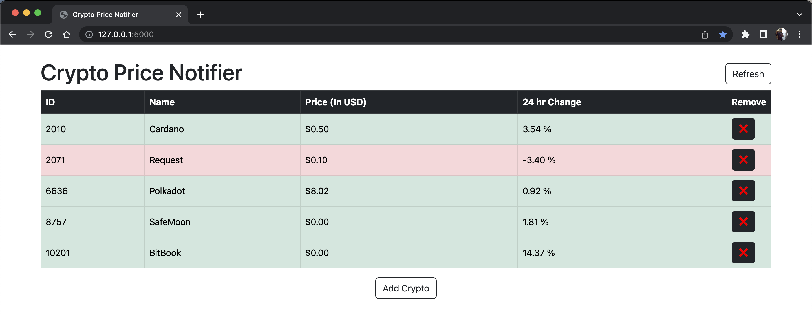
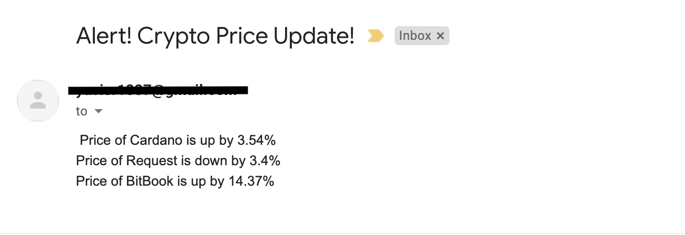

# CRYPTO PRICE NOTIFIER

A CRUD Flask based web app that uses Coin Market Cap API to fetch the real-time prices of cryptocurrencies added in our wish list.

The data of our added crypto is stored in a SQLite Database connected to our program using SQLAlchemy.

If the price of the crypto changes by a certain percentage in the last 24 hours, the app sends an email to the user using SMTP.

## Tech Stack

**Client:** HTML, Bootstrap5, SCSS

**Server:** Flask, Python

**Database:** SQLite

## Screenshots

